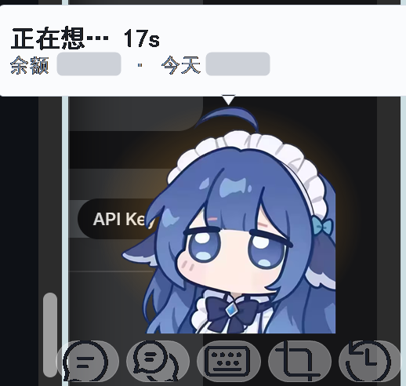
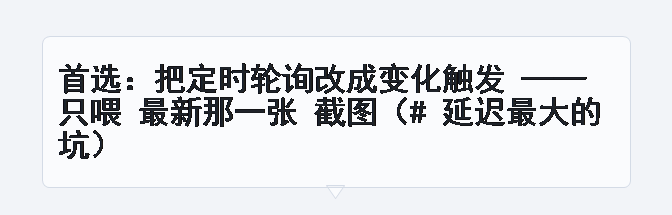
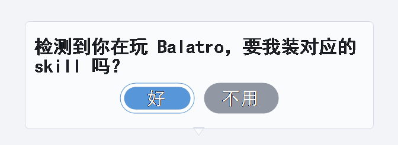
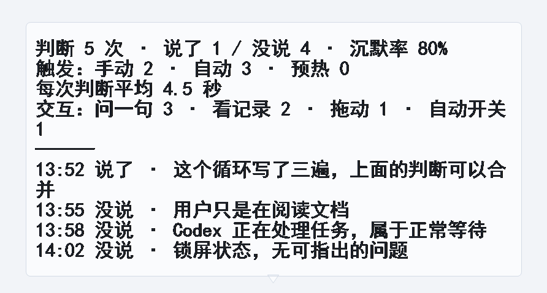
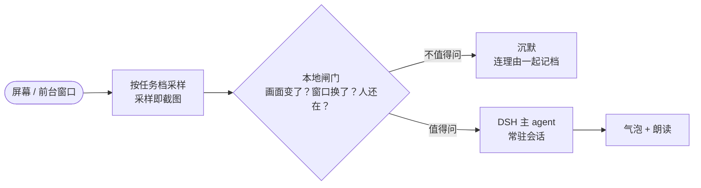

<div align="center">
  <a href="https://github.com/Jasolicon/dsh-desktop-pet-assistant-bloop" target="_blank">
    
  </a>
  <h1>
    <a href="https://github.com/Jasolicon/dsh-desktop-pet-assistant-bloop" target="_blank">泡泡 · Bloop</a>
  </h1>
</div>

<p align="center">🐳 PowerShell 7 × WinForms × DeepSeek Harness —— 一只自己看屏幕的桌面鲸鱼：值得说才开口，不值得就闭嘴。</p>

<p align="center">
  <a href="LICENSE"></a>
  <a href="https://github.com/Jasolicon/dsh-desktop-pet-assistant-bloop"></a>
  <a href="https://github.com/Jasolicon/dsh-desktop-pet-assistant-bloop"></a>
  <a href="https://github.com/Jasolicon/dsh-desktop-pet-assistant-bloop"></a>
</p>

> [!TIP]
> 它大多数时候**什么都不说** —— 沉默也是一次判断的结果，每一条"没说"连同理由都记在本机日志里。
> 想看它话痨一点：右键 →「设置 → 说话风格 → 损友（先吐槽再给建议）」。

## 💡 这是什么

Windows 桌面宠物，也是一个**主动式**助手：不需要提问，也不需要用户先意识到自己卡住了。
它在后台按任务节奏采样屏幕（每次采样都带一张截图），先由本地代码判断"值不值得打扰"，
再由模型决定"说什么"。

用 AI 的人都会遇到同一个矛盾：**要它帮忙，得先知道自己卡住了，还要有余力开口。**
做菜、修理、开会、赶表格的时候，这两个前提常常同时不成立 —— 手被占着，注意力也被占着，
于是既想不到要问，也腾不出手去问。

| 常见的失效 | 它的做法 |
| --- | --- |
| 来不及问（双手被占 / 正在通话） | 自己看，不需要用户开口 |
| 不知道自己卡住了（同一处试到第三遍） | 看着操作，试到第三次说一句 |
| 每次都要重述背景 | 保留当天的观察与判断记录，不必重新交代 |

它一次只说一句。**沉默不是"没有输出"，而是一次判断的结果** ——
这是它和"随叫随到"的助手的根本区别。

下面两类例子都取自它自己的判断日志。

**它说过的：**

> 「两个桌宠叠一起时按钮会互相抢点击 —— 确认旧实例真的退出了没有。」
>
> 「鼠标悬停时倒计时要暂停，否则正要点击的瞬间按钮就消失了。」
>
> 「同一个循环整理第三遍了，上面的判断可以合并。」

**它选择沉默的（理由同样记录在案）：**

> *「任务正在正常跑、用户在等它 —— 这属于正常等待，没有可证明的错误。」*
>
> *「用户只是在阅读文档。」*
>
> *「屏幕上没什么异常，也说不准在发生什么。」*

## 📥 下载

本项目不发布二进制安装包 —— 它就是一个 PowerShell 脚本，**拉下来就能跑**（不需要 Docker，也不需要单独申请模型 key）。

```powershell
git clone https://github.com/Jasolicon/dsh-desktop-pet-assistant-bloop.git
cd dsh-desktop-pet-assistant-bloop
pwsh -NoProfile -ExecutionPolicy Bypass -File .\desktop-guide\DesktopGuide.ps1
```

## 🛠️ 安装

### 📋 环境要求

| 需要 | 说明 |
| --- | --- |
| **PowerShell 7（必须）** | 不能用系统自带的 5.1 —— 它跑的是 .NET Framework，`Add-Type` 的引用解析方式完全不同，脚本开头的版本守卫会直接拒绝并提示升级。一条命令装好：`winget install Microsoft.PowerShell`（用户级，不用管理员） |
| **DeepSeek Harness** | 桌宠把它当作"大脑"（用 DSH 里已登录的账号，无需另配 key） |
| 语音输入（可选） | 首次使用按需下载 SenseVoice 模型，约 229MB；识别全程在本机离线完成 |
| 语音朗读（可选） | 默认走微软 Edge 神经音色（需要联网）；断网时可在设置里切到本机音色 |

角色图随仓库自带（`desktop-guide/assets/pet.png`），不需要安装其它插件；想换成自己的图，覆盖该文件即可。

### 🔧 启动

三条路，任选一条：

1. 上面那条 `pwsh -File ...\DesktopGuide.ps1`；
2. 双击 `desktop-guide\start.cmd`（保持那个窗口开着，关掉它就停）；
3. 跑一次 `desktop-guide\make-launcher.ps1`：它会在桌面和仓库目录各生成一个「泡泡桌宠.lnk」
   （图标用角色图现生成），以后双击那个。

开机启动：右键 →「设置 → 开机启动（跟 Windows 一起起）」（写 HKCU 的 Run 项，不需要管理员）。

> [!IMPORTANT]
> 同时只会有一个桌宠。启动脚本自己会拦重复实例，而且是**跨形态互斥** ——
> 已经独立运行时又去开插件外壳，后起的那个会直接退出。

### 🧪 自检

```powershell
pwsh -NoProfile -ExecutionPolicy Bypass -File .\desktop-guide\DesktopGuide.ps1 -SelfTest
```

它会现编译 C# 再跑几十项断言：界面排版、判断闸门、监控区域、账本、权限审批、托盘、子 agent 窗口……
预览图写进 `desktop-guide\run\`。改过代码之后先跑它，比"重启看看"快得多。

### ⚙️ 配置

所有可调项都在 `desktop-guide\config.json`；右键 →「设置 → 所有设置…（一个窗口改完）」是同一个文件的可视化版本，
改完立刻生效。先看几个常用的：

| 配置项 | 默认 | 说明 |
| --- | --- | --- |
| `speakStyle` | `coach` | 说话风格：`guard` 保守（只在明显问题时说）/ `coach` 陪练（每次都建议）/ `roast` 损友（画面没变也陪着说两句） |
| `roastMinSeconds` | `30` | 损友模式的最短间隔，同时也是它的检查节拍 |
| `dailySpendCapYuan` | `50` | 每日消费上限，到线自动暂停；`0` = 不设上限 |
| `autoMinutes` | `1` | 非损友模式下"自动看一眼"的节奏 |
| `judgeMinSeconds` / `judgeMinFpDelta` | `60` / `12` | 本地闸门：两次判断的最小间隔、画面指纹差异阈值 |
| `taskRules` | 见文件 | 任务档：按进程名 / 窗口标题匹配，决定"多久看一眼"和"这类任务该怎么帮" |
| `ttsEnabled` / `ttsEngine` | `true` / `auto` | 朗读开关与引擎（`edge` 神经音色 / `speech` 本机音色） |
| `sttEnabled` | `true` | 语音输入开关 |
| `chatUi` | `dsh` | 「对话」打开什么：`dsh` = DSH 自带 Web 界面；`bubbles` = 自绘气泡（兜底） |
| `webModel` | 空 | 「对话」窗口用哪个模型（填 `agents.json` 里的 `name`；留空 = 第一个） |

## 🎯 它能做什么

### 🫧 主动提示：不开口也会说

后台按任务档采样屏幕，**"值不值得问"由本地判据决定**（画面指纹是否变化、前台窗口是否切换、
距上次判断多久、用户是否闲置、是否处于待机）；放行之后才起一次模型调用，结果用气泡显示并朗读。



限制：一次只说一句；判断质量取决于它对"什么算异常"的理解，提示词是主要调节点。
另外，**没有截图的轮次它不会硬答**：截图缓冲为空、或最新一张超过 30 秒，提示词会禁止它依据窗口标题
推断画面、禁止给出具体操作步骤 —— 只能说"现在看不到画面"。

### 💬 对话

右键「对话」打开 DSH 自带的 Web 界面（Edge `--app=` 无地址栏模式）：Markdown、工具卡片、流式输出、
会话侧栏都由 DSH 渲染，不是自绘的聊天框。

限制：打开的就是桌宠主 agent 的会话；同一会话同时只允许一个写入者，若在别处也打开了同一会话，
下一轮会自动判断会撞上"主会话被别处占着"，气泡会直接提示。

### 📣 派活：语音、打字、拖文件

- **语音**：长按桌宠说话，松手后由 SenseVoice 在本机离线识别（首次使用按需下载约 229MB 模型），
  识别结果直接派给后台 agent 执行，不是丢进对话框聊天。实测一句"查一下 CPU 占用"9.3 秒出结论。
- **打字**：`Ctrl+Alt+T`、底部键盘按钮或右键菜单，和语音走完全相同的下游管线。
- **拖文件**：按 DSH 原生 `@path` 引用写进任务，模型自行调用 `read` / `read_image` 读取
  （拖入图片时调用的是 `read_image`）。只丢文件、没有附加要求时，会补一句最小任务。

完成后桌宠把最后一行结论报出来并朗读；失败也会如实回报。

默认每次派活都**新建一个 agent**。想让后续派活都交给同一条 agent（接着它的会话跑、上下文不断），
打开右键 →「更多 → 子 agent 管理（记录 / 中断 / 派活）…」，在里面选一条即可；
同一个窗口还能新建、删除、看它的记录、中断它，选择会被记住。

### 🎮 游戏里的实时建议

任务档按**进程名或窗口标题**匹配（内置 `balatro` / `slay` / `sts` / `hearthstone` / `mtga` / `yugioh` 等），
命中后把采样提高到 **0.6 秒一张**、最短 20 秒才可能再次开口；提示词中预先写明这类任务的关注顺序：
当前手牌能凑出的牌型 / 连招、本轮出牌顺序、资源（费用、血量、手牌数）的风险，并禁止复述界面上已有的数字。

未内置的游戏在 `desktop-guide/config.json` 的 `taskRules` 里加一行即可（进程名、采样秒数、
一句"这类任务优先看什么"）。

### 📄 文档、表格、演示文稿

把文件拖到桌宠身上并附一句要求（例如"把 report.docx 第三段加粗"），或通过语音 / 打字派活。
工作 agent 挂了 `office-docx` / `office-pptx` / `office-xlsx` 三个 skill，支持创建、局部编辑、结构检查、
渲染 PDF 与交付声明。

限制：它操作的是**文件本身**，不驱动 WPS / Word 窗口；文件同时被编辑器打开时，注意重载提示。

### 🧩 插件管理与运行时查询

`plugin_manager` 是 DSH 原生工具（列出已装插件、列出可选 bundle、开关插件、安装 bundle 等八个 action），
桌宠只是把默认关闭的开关打开，因此插件管理与 DSH 是同一套。另有三个只读的 `cordis_inspect_*` 工具，
用于在改插件前查询运行时契约。

限制：可以列出"已装 / 可选"，但**不能按关键词搜索 npm** —— 要安装需给出包名、git 地址或本地路径。

### ✅ 权限审批与提问应答

无头模式的 DSH 默认没有应答者（权限审批一律拒绝、`ask_user_question` 不可用）。桌宠补上了这一环：
气泡上出现「允许 / 拒绝 / 稍后」，或请求自带的选项标签。



限制：默认等待 45 秒；超时或选择「稍后」视为未作答，不会伪造一个答案回填给模型。

### 🗂️ 判断记录与后台进度

右键「更多 → 看它判过什么」显示卡片：判断次数、说了几次、沉默几次、每条沉默的理由。
后台 agent（包括它再开的子 agent）运行时，气泡每 3 秒更新当前动作（如"改文件：xxx.docx"）。



记录保存在本机日志里，重启后仍在。卡片不会自动消失，点右上角的 **×** 收起（右键「更多 → 收起气泡」同效）。

## 🕹️ 操作一览

它平时就是桌角一只会眨眼的小宠物。透明区域点击会穿透，不遮挡下层窗口，也永远不抢焦点。

| 操作 | 效果 |
| --- | --- |
| 左键单击（或 `Ctrl+Alt+G`） | 立刻判断一次并给出建议；**它正在朗读时，这一下是让它闭嘴**，不会叠加新判断 |
| 长按约 0.4 秒 | 开始录音，松手后识别并派活；**开麦前会先停掉正在进行的朗读** |
| `Ctrl+Alt+T` / 右键「打字派活」 | 输入一句话派活（与语音同一条管线） |
| 双击 | 完全打断：停止朗读，并取消正在进行的这一轮思考 |
| 点常驻气泡右上角的 **×** | 收起这张气泡（判断记录卡片等不会自动消失的气泡） |
| 拖文件 / 文字到它身上 | 作为任务交给它 |
| 右键 | 菜单：现在说一句 / 对话 / 语音输入 / 打字派活 / 更多 / 设置 / 退出 |
| 托盘图标 | 左键显示 / 隐藏；右键可暂停（暂停时桌宠头顶左上角有一个暂停标） |

**底部那排按钮**（从左到右）：问一句 · 对话 · 打字派活 · 框选监控区域 · 看它判过什么。
鼠标悬停会浮出名字；「框选监控区域」变淡黄色 = 现在只截你框的那一块。

**打断语音的三条路**：它正在说话时单击宠物（最直接）、双击宠物（连正在跑的判断一起取消）、
右键「设置 → 朗读 → 停止朗读（打断）」。误打断了也不亏，同一条子菜单里的「重读上一句」可以复读。

**账本**：气泡最下方常显一行小字「余额 · 上次调用 · 今天」。余额增加（充值）会播报一次，
默认每 30 分钟也会主动报一次；API key 在右键 →「设置 → 填 API key…」里配置。可以设**每日消费上限**
（默认 50 元）：今天的花费到线就**自动暂停**、不再自己观察，页脚会显示「今天 ¥x / 上限 ¥y」。

## 🚫 它不做什么

| 不做 | 原因 |
| --- | --- |
| 不监听键盘输入 / 不读剪贴板 / 不记录窗口内的文字 | 侵入性过强，对判断帮助有限 |
| 不抢焦点 | 可点击、可拖动，但永远不激活、不打断当前操作 |
| 不替用户在其它窗口里点鼠标、敲键盘 | 它的操作落在文件上（读、改、渲染、交付） |
| 不把截图落盘 | 截图只保留在内存环形缓冲中，落盘的只有窗口标题 / 进程 / 时间 |
| 不在忙碌时插话 | 用户一操作就立刻让位；黑屏 / 锁屏 / 睡眠期间直接待机 |
| 不写"什么时候该说"的硬规则 | 该不该说由可测试的本地判据决定，说什么才交给模型 |

## 🧭 技术架构

- **门控在本地**：模型对"何时介入"的判断通过率不足一半，因此是否打扰由确定性代码决定，
  且可穷举单测；模型只负责把话说好。
- **采样率跟着任务走**：卡牌 0.6 秒 / 视频 8 秒 / 桌面 10 秒，**采样即截图** ——
  降低采样率就等于减少截图、降低开销。
- **常驻运行时**：通过 DSH 的 sdk profile（stdio JSON-RPC）常驻一个大脑，每轮判断从 8–25 秒压到
  0.9–1.5 秒；语音朗读另有一个常驻的"播音员"进程，所以第一句和第一百句的出声延迟一样。
- **用户操作优先**：用户一动手，自动判断立刻让位，停手后补做；双击打断则不补做。
- **待机不装忙**：读系统信号（显示器电源 / 会话锁 / 睡眠）而不是靠抓屏失败猜；唤醒后作废过期观测。
  每 30 秒还会自检一次实时状态（有人在动键鼠 + 没锁屏 + 能抓到屏），前台窗口一换也立刻试一次，
  防止系统通知漏发后一直以为在待机 —— 那样它会没有截图、只能照窗口标题猜。菜单里另有
  「我是醒着的（现在就看一眼）」这个手动出口，不必重启进程。
- **界面是自绘的**：WinForms 分层窗口逐像素 alpha，常驻气泡 / 选项按钮 / 底部按钮条都在
  `desktop-guide/DesktopGuide.ps1` 里画；「对话」则直接开 DSH 自己的 Web 界面，不重造 Markdown 渲染。



工程细节（含每个决定的理由与实测数据）见 [`desktop-guide/README.md`](desktop-guide/README.md)，
产品层面的决策记录见 [`随时指导项目_总纲.md`](随时指导项目_总纲.md)。

## 📌 项目状态

| | |
| --- | --- |
| **可用** | [`desktop-guide/`](desktop-guide/) —— PowerShell + WinForms 版，功能最全 |
| **迁移中** | [`desktop-pet/`](desktop-pet/) —— Electron 版，见其 README 与 MIGRATION.md |
| **已停用** | [`ambient-guide/`](ambient-guide/) —— 最早的 DSH 插件形态，保留作历史 |

**已知限制**

- 只支持 Windows
- 多显示器只抓主屏；全屏独占程序（部分游戏）抓不到
- 语音识别是整句的，不支持边说边出字
- 判断质量取决于它对"什么算异常"的理解，这是唯一需要持续调校的部分

## 📜 许可证

- **许可**：[PolyForm Noncommercial License 1.0.0](LICENSE) —— **非商业使用免费，商业使用需另行授权**。
  个人研究、实验、学习、娱乐、业余项目可自由使用；慈善 / 教育 / 公共研究 / 公共安全 /
  政府机构属于允许用途。可以修改和分发，但需随附该许可，且不得用于商业目的。
- **它不是 OSI 开源许可**：PolyForm Noncommercial 属于源码公开（source-available）、非商业可用，
  没有"修改后必须开源"的义务。选择它而非 CC 系内容许可，是因为它专为软件撰写，含专利防御条款。
- **文件头声明**：所有源码文件开头都带 `Copyright (c) 2026 https://github.com/Jasolicon` 与
  `SPDX-License-Identifier: PolyForm-Noncommercial-1.0.0`；分发时请连同署名与许可一起保留
  （PolyForm 的 Required Notice 写在 [LICENSE](LICENSE) 开头）。
- **角色形象不归本项目**：仓库自带的角色图（`desktop-guide/assets/pet.png` 与
  `desktop-pet/assets/pet.png`）**不在上述许可范围内**，作者不主张任何权利、不署名、不收费；
  来源不可考，按"网上流传的表情包"处理。权利人提出要求即替换或移除，详见
  [`THIRD_PARTY_NOTICES.md`](THIRD_PARTY_NOTICES.md) 与
  [`desktop-guide/assets/PROVENANCE.md`](desktop-guide/assets/PROVENANCE.md)。
- **第三方组件**：运行时借用的 DSH、sherpa-onnx、SenseVoice 模型、Node.js、Electron、Edge 等，
  授权与使用方式逐条列在 [`THIRD_PARTY_NOTICES.md`](THIRD_PARTY_NOTICES.md)。

## ❓ 常见问题

### 🔒 它会记录我的键盘输入或屏幕内容吗？

不监听键盘输入、不读剪贴板、不记录窗口内的文字。**截图不落盘** —— 截图只留在内存环形缓冲里，
落盘的只有窗口标题 / 进程名 / 时间。判断记录与账本都是本机产生的数据，仓库里不含任何真实数据。

### 💸 它会自己花钱吗？

它用的是你 DSH 里已登录的账号，每一轮判断、每一次派活都是一次真实的模型调用。
账本会记着"上次调用花了多少"，并且可以设每日上限（默认 50 元）—— 到线就自动暂停，不再自己观察。
手动点它问一句仍然会花钱，那是你主动要的。

### 🔑 需要自己申请 API key 吗？

默认不需要，直接用 DSH 已登录的账号。想换成别的供应商，右键 →「设置 → 填 API key…」。

### 🤫 为什么它大多数时候都不说话？

因为"该不该开口"是由本地判据决定的，而判据的默认口味偏保守：画面没变、刚判过、人不在、
正在忙、在待机 —— 这些都不打扰。想让它话痨一点：右键 →「设置 → 说话风格 → 损友」。

### 🖥️ 支持多显示器 / 全屏游戏吗？

只抓主屏。全屏独占程序抓不到画面 —— 那种情况下它会明确说"看不到画面"，
而不是照窗口标题编出一串操作步骤。

### 🐢 第一次打开为什么要等十几秒？

要起两个东西：「对话」用的 DSH Web 服务，和常驻大脑。两个都丢在后台预热，界面不会卡；
第一次点「对话」时如果服务还在起，气泡会告诉你"正在起来（首次要等 DSH 服务，十几秒）"。

## 🙏 特别感谢

- **DeepSeek Harness** —— 桌宠的大脑：判断、派活、工具调用、Web 对话界面都靠它
- [sherpa-onnx](https://github.com/k2-fsa/sherpa-onnx) 与 SenseVoice —— 本机离线的语音识别
- 微软 Edge 神经音色 —— 默认的朗读声音

<div align="center">
版权所有 © 2026 - <strong>泡泡 · Bloop</strong><br>
By <a href="https://github.com/Jasolicon">Jasolicon</a><br>
Made with 🐳 &amp; ⌨️
</div>
